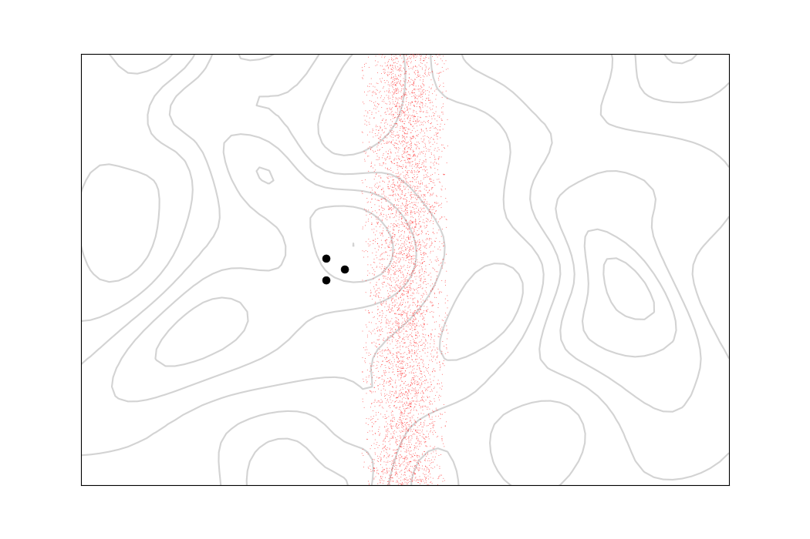
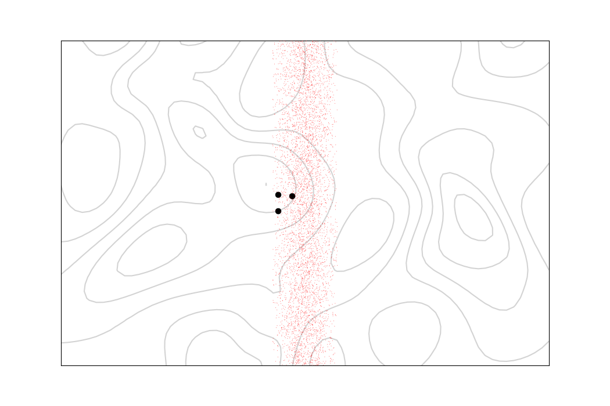
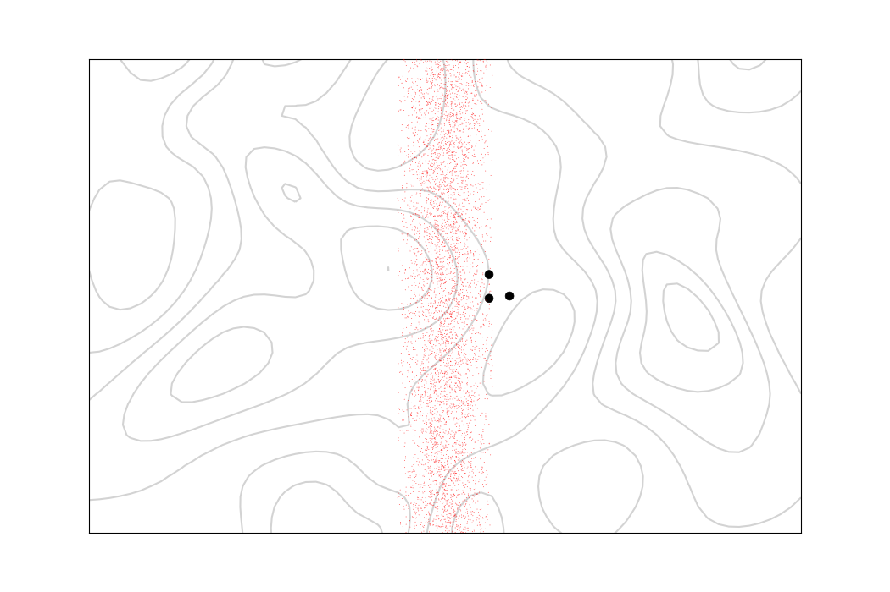
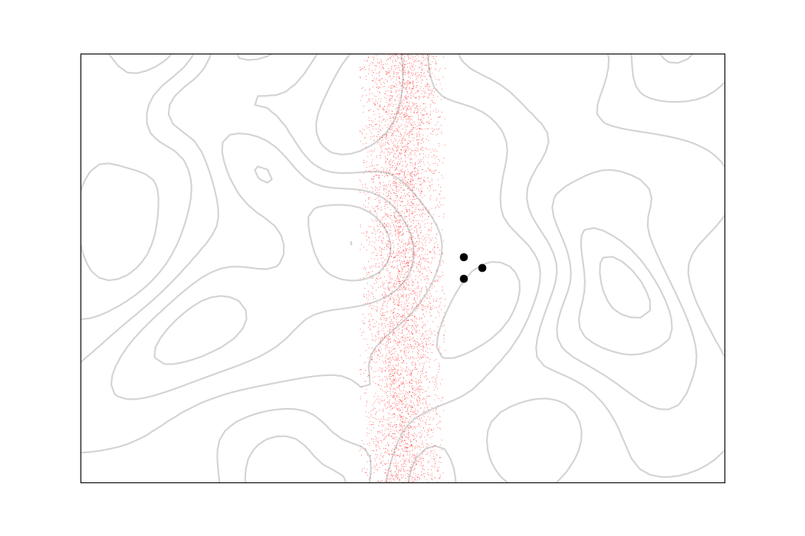

# ThreeAgents
Minimalistic multi-agent simulation with three agents moving in a formation on a plane. And coping with the disturbance from the environment.
<p align="middle">
  
  
  
  
</p>
The images above show how the agents (black dots) are able to recover their formation after passing trough the disturbance flow (red dots).

## Overview
### Background and motivation
I saw a [video](https://www.youtube.com/watch?v=stzQNjtDg0g) on YouTube about controlling robot swarms. In it the topic is introduced with the example of controlling three robots moving in a formation. I wanted to try out something similar, but instead in a simplified multi-agent simulation. Namely, in two kinds of situations:

1. In a centrally controlled setting where each agent gets its directions from a controller.

2. In a setting where one agent is the lead and the others try to follow it from a given distance away from it.

Furthermore, as in the original example, I wanted the agents to be able to cope with the disturbance from the environment. Technically the first case actually reduces to a single-agent system, since the central controller is making all the movement decisions. Nevertheless, for practical purposes it is interesting to compare both approaches.

### About the implementation
The course corrections are done by keeping track of what the velocity and position should be at each time step, if there would not be any disturbance from the environment. These differences are calculated based on the past time step disturbance and used for adding a correction component to the velocity. The centrally controlled model uses this with all agents
and the one lead model only with the lead agent.

Taking and maintaining of the formation is done by adding two components to the agent's velocity. These act like springs connecting the agent to the other agents with the targeted distance between the agents been like the spring's rest length. The exception here is that the strengths of these components are linearly proportional to the agents distance from the rest position (for real spring this velocity dependence would be quadratic). Purpose of this linear dependence is to reduce vibrational movements. For the centrally controlled model all the agents execute this and for the one lead model only the follower agents do it.

In the current implementation the formation updates have slight problems in the one lead case. Namely, the formation gets elongated during movement and its tail drifts slightly sideways when the lead agent turns. These effects could most likely be reduced by taking into account the lead agents velocity in the formation updates. I might add this change later.

#### Comparison with the Boids model
The [Boids](https://www.red3d.com/cwr/boids/) model is used for simulating flocking. It uses local rules for separation, alignment and cohesion. Some variants of the model also implement goal-seeking and obstacle avoidance behavior. In particular, the Boids model dose not try hold any fixed formation. (I will probably experiment with the Boids model in the future.)

## Installation
Clone this repository and install the libraries with pip:
```
git clone https://github.com/JussiM01/ThreeAgents.git
pip install -r requirements.txt
```
I used Python 3.8 but the code probably works also with slightly earlier versions. I have only tested the code on a machine with Ubuntu 20.04.2.0 LTS (Focal Fossa). Other operating systems might need some tweaks for matplotlib to work properly.

## How to use
The program is run by running the main python-file from the command line:
```
python3 main.py
```
This will run the program with the default configuration. Other configurations can be used with the command:
```
python3 main.py -f <filename>
```
where ```<filename>``` is the name of the config-file. The config-files are located in the ```./config_files``` folder.
For the creation of user's own configurations, I have also added there ```config_creation.ipynb``` Jupyter notebook file.

The other command line arguments include ```--random_seed```and the relative coordinate ranges ```--x_min```, ```--x_max```, ```--y_min``` and ```--y_max```  for the area of location where the agents'
initial positions are chosen randomly. The arg ```--remove_visuals``` can be used for removing the flow and background visualizations and the  ```--remove_environment``` for removing the whole environment. Finally, there are also args ```--use_ticks``` for setting ticks visible in the animation plot and ```--use_grid``` for creating a grid in. All
non-optional args have preset default values.

Example:
```
python3 main.py -x0 0.1 -x1 0.2 -y0 0.8 -y1 0.9 -r 0 -t
```
This command uses the default config-file but sets the random positions near the top left corner and the random seed to value 0. Lastly it puts the coordinate-ticks into the plot.

Full list of the command line args and their abbreviated forms:  
```--conf_file``` or ```-f```  
```--x_min``` or ```-x0```  
```--x_max``` or ```-x1```  
```--y_min``` or ```-y0```  
```--y_max``` or ```-y1```  
```--remove_visuals``` or ```-rv```  
```--remove_environment``` or ```-re```  
```--use_ticks``` or ```-t```  
```--use_grid``` or ```-g```  
```--random_seed``` or ```-r```

### Config-files
There are three config-files. The default file is ```central_control.json```. Like the names says, it initializes a centrally controlled model. The other two files are ```one_lead.json``` and ```accelerations.json```. These both initialize a one lead model, the main differences is in their task lists. The first one uses only straight constant velocity movements and the second one only accelerations tasks, which enables curved movements.

As mention earlier, the inbuilt config-files are located at the config-files folder and there is also a Jupyter notebook for creating custom files. Especially the task list modification should be relatively easy.

### Config-file and task list structure

See the [file](./docs/config_structure.md) ```./docs/config_structure.md``` for details.

## Tests
The unit tests are located at the tests folder and can be run with the following command:
```
python3 -m pytest
```

## Possible future updates
At the moment my focus is in other things, but I might later add some of the following things to this project:

- Graphical user interface (for interaction model selection, route setting by clicking targets on the image with mouse, etc.).
- More physically accurate modeling (use of accelerations in all movements, longer/adjustable time delays in the course corrections, etc.).
- More options for the disturbance vector fields.

## License
